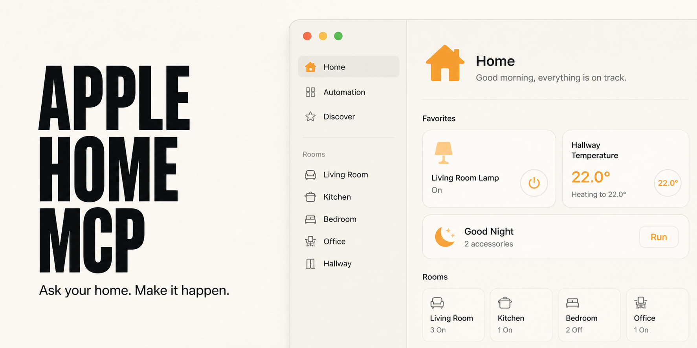
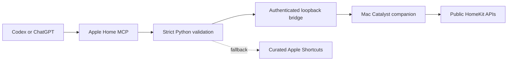

<p align="center">
  
</p>

<h1 align="center">Apple Home MCP</h1>

<p align="center"><strong>Ask your home. Make it happen.</strong></p>

<p align="center">
  <a href="https://github.com/henryvn27/apple-home-mcp/actions/workflows/ci.yml"></a>
  <a href="LICENSE"></a>
  
  
  
</p>

A local MCP plugin that lets Codex or ChatGPT inspect Apple Home, read live
state, write public HomeKit characteristics, and run scenes. A universal Apple
companion provides direct HomeKit access on iPhone, iPad, and Mac Catalyst. The
curated Shortcuts bridge remains available as a fallback.

```text
You: What can you control in the office?
AI: The desk lamp exposes power, brightness, hue, and saturation.

You: Set it to a warm orange at 35 percent.
AI: Set the desk lamp brightness, hue, and saturation.

You: Run Good Night.
AI: Ran the Good Night scene.
```

No cloud relay, Home Assistant instance, private iCloud endpoint, or Home.app
screen scraping. Direct mode uses Apple's public HomeKit APIs. It can reach the
characteristics HomeKit marks readable or writable, including granular values
such as brightness, color, fan speed, position, and thermostat targets when an
accessory exposes them. Private Siri services are not emulated.

## Install in Codex

```bash
codex plugin marketplace add henryvn27/apple-home-mcp
codex plugin add apple-home@apple-home-mcp
```

This installs the MCP plugin. Direct HomeKit access also needs the Apple Home
Bridge companion described below; the Shortcuts fallback does not.

### Let an agent install it

Paste this into a Codex task:

```text
Install the Apple Home plugin from
https://github.com/henryvn27/apple-home-mcp on this Mac.

First inspect configured plugin marketplaces and installed plugins. If an
Apple Home plugin is already enabled from another marketplace, stop and explain
the conflict. Do not install a duplicate or remove existing config.

Otherwise, run:
codex plugin marketplace add henryvn27/apple-home-mcp
codex plugin add apple-home@apple-home-mcp

Verify that apple-home@apple-home-mcp is installed and enabled. Tell me to start
a new Codex task so the plugin loads. For direct HomeKit access, point me to the
Apple Home Bridge setup in the repository and explain that I must choose a
development team and grant Home access myself. If I prefer the Shortcuts
fallback, tell me how to create the Apple Home MCP folder. Do not inspect Home
data, create shortcuts, or run a physical action during installation.
```

Start a new Codex task after installation.

## Direct HomeKit setup

Apple exposes HomeKit to iPhone and iPad apps and to Mac apps built with
[Mac Catalyst](https://developer.apple.com/forums/thread/822517). The Mac
Catalyst build is the local bridge for Codex because the MCP connection stays
on loopback.

1. Open the Apple Home Bridge Xcode project included in this repository.
2. Select your Apple development team for the app target.
3. Run the **My Mac (Mac Catalyst)** destination and grant Home access.
4. Keep Apple Home Bridge running while an agent uses the direct tools.

For a high-risk control, the first confirmed tool call does not execute it. The
companion shows the exact target and value under **Pending approval**. Choose
**Approve** or **Reject** in the app. Approval permits one identical retry for
60 seconds; it does not run the action by itself. A changed, expired, or replayed
request fails closed and needs a new approval.

The same target runs on iPhone and iPad for permission and UI testing, but an
MCP server on a Mac connects to the Mac Catalyst build. The bridge token never
leaves the Mac.

## Shortcuts fallback

The fallback uses Apple's
[built-in Shortcuts command-line tool](https://support.apple.com/guide/shortcuts-mac/apd455c82f02/mac)
and does not require the companion.

1. Open **Shortcuts** and create a folder named **Apple Home MCP**.
2. Add only the Home capabilities you want AI to access.
3. Name each shortcut with one exact prefix:

| Prefix | Example | MCP behavior |
| --- | --- | --- |
| `Read - ` | `Read - Living Room Temperature` | Runs through `read_home_state`; return text or JSON |
| `Control - ` | `Control - Desk Lamp` | Runs through `run_home_action`; confirmation required |
| `Scene - ` | `Scene - Good Night` | Runs through `run_home_scene`; confirmation required |

For a state query, add Home's **Get the state of** action and finish with
**Stop and Output**. For a control or scene, add Home's **Control** action. Keep
these shortcuts non-interactive: alerts and menus pause command-line execution.

Optional dynamic input arrives as a temporary UTF-8 file. In Shortcuts, read
**Shortcut Input** as text before branching on it.

Then ask:

```text
Check the Apple Home bridge status.
List the Home actions I allowed.
Read the living-room temperature.
Turn on the desk lamp.
Run my Good Night scene.
```

## Tools

| Tool | What it does | Safety |
| --- | --- | --- |
| `get_home_bridge_status` | Checks direct HomeKit and Shortcuts availability | Read-only; runs nothing |
| `list_home_inventory` | Lists homes, rooms, zones, accessories, services, characteristics, properties, and metadata | Read-only; sensitive Home data |
| `read_home_characteristic` | Refreshes one exact readable characteristic | Read-only; stable UUID path |
| `write_home_characteristic` | Writes one exact characteristic after metadata validation | Explicit confirmation; exact one-use in-app approval for high-risk services |
| `list_homekit_scenes` | Lists HomeKit action sets and scenes | Read-only |
| `run_homekit_scene` | Runs one exact HomeKit scene | Explicit confirmation; exact one-use in-app approval when required |
| `list_home_actions` | Lists curated reads, controls, and scenes | Read-only; exact folder |
| `read_home_state` | Runs one `Read - ` shortcut and returns text/JSON | Read-only contract |
| `run_home_action` | Runs one `Control - ` shortcut | Explicit confirmation; physical effect |
| `run_home_scene` | Runs one `Scene - ` shortcut | Explicit confirmation; multi-device effect |

The plugin resolves each shortcut's native UUID before execution, rejects
duplicates, uses fixed process arguments with no shell, limits output to 1 MiB,
and removes optional input files immediately.

Controls and scenes are marked destructive because they affect the physical
world. In direct mode, locks, garage doors, security systems, alarms, cameras,
access control, emergency functions, and equivalent services require in-app
human approval. That approval is bound to the operation, full HomeKit UUID path
or scene, and exact scalar value; it expires after 60 seconds and is consumed
before the mutation. Do not place those controls in the Shortcuts fallback; it
cannot add the same approval gate.

Use another folder by setting `APPLE_HOME_MCP_FOLDER` in the MCP environment.

## How it works



The companion uses HomeKit's public homes, accessories, services,
characteristics, metadata, and action sets. It does not read the private Home
database or promise Siri behavior Apple keeps outside the public framework.

## ChatGPT

ChatGPT cannot call a local stdio MCP process directly. OpenAI's
[Secure MCP Tunnel](https://developers.openai.com/api/docs/guides/secure-mcp-tunnels)
can expose this server through an outbound-only connection when your plan and
workspace support developer-mode MCP actions.

```bash
export CONTROL_PLANE_API_KEY="<runtime API key>"
tunnel-client init \
  --sample sample_mcp_stdio_local \
  --profile apple-home \
  --tunnel-id "<tunnel_id>" \
  --mcp-command "/usr/bin/python3 /absolute/path/to/apple-home-mcp/plugins/apple-home/server.py"
tunnel-client doctor --profile apple-home --explain
tunnel-client run --profile apple-home
```

Treat Home state and physical controls as sensitive. Never commit the runtime
API key or tunnel profile.

## Develop

```bash
cd apple-home-mcp
/usr/bin/python3 -m unittest discover -s plugins/apple-home/tests -v
/usr/bin/python3 -m py_compile plugins/apple-home/server.py plugins/apple-home/companion.py
xcodebuild test \
  -project AppleHomeBridge.xcodeproj \
  -scheme AppleHomeBridge \
  -destination 'platform=macOS,variant=Mac Catalyst' \
  CODE_SIGNING_ALLOWED=NO CODE_SIGNING_REQUIRED=NO
```

Automated Python tests mock the companion socket and `/usr/bin/shortcuts`.
Swift tests use a mock Home graph. They never inspect Henry's Home or control a
real accessory. GitHub Actions also builds and tests the app against an exact
iOS Simulator destination.

## Security

Read the full boundary in [SECURITY.md](SECURITY.md). Report vulnerabilities
through [GitHub private vulnerability reporting](https://github.com/henryvn27/apple-home-mcp/security/advisories/new).

## License

MIT © Henry Van Ness

Apple, Apple Home, HomeKit, and Shortcuts are trademarks of Apple Inc. This
project is independent and is not affiliated with or endorsed by Apple.
