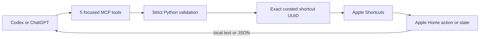

<p align="center">
  
</p>

<h1 align="center">Apple Home MCP</h1>

<p align="center"><strong>Ask your home. Make it happen.</strong></p>

<p align="center">
  <a href="https://github.com/henryvn27/apple-home-mcp/actions/workflows/ci.yml"></a>
  <a href="LICENSE"></a>
  
  
</p>

A tiny, local-first MCP plugin that lets Codex or ChatGPT read and run the
Apple Home automations you explicitly place in one Shortcuts folder.

```text
You: What Home actions can you access?
AI: I can read the living-room temperature, control the desk lamp,
    and run your Good Night scene.

You: What's the living-room temperature?
AI: 72°F.

You: Turn off the desk lamp.
AI: Ran “Desk Lamp”.
```

No cloud service, Home Assistant instance, private iCloud endpoint, or Home.app
screen scraping. You choose the exact capabilities. The MCP can do nothing
outside that allowlist.

## Install in Codex

```bash
codex plugin marketplace add henryvn27/apple-home-mcp
codex plugin add apple-home@apple-home-mcp
```

### Let an agent install it

Paste this into a Codex task:

```text
Install the Apple Home plugin from
https://github.com/henryvn27/apple-home-mcp on this Mac.

First inspect configured plugin marketplaces and installed plugins. If an
Apple Home plugin is already enabled from another marketplace, stop and explain
the conflict. Do not install a duplicate or remove existing config.

Otherwise, run:
codex plugin marketplace add henryvn27/apple-home-mcp
codex plugin add apple-home@apple-home-mcp

Verify that apple-home@apple-home-mcp is installed and enabled. Then tell me to
create a Shortcuts folder named Apple Home MCP and start a new Codex task so the
plugin loads. Do not create or run Home shortcuts without asking me first.
```

Start a new Codex task after installation.

## Two-minute Home setup

Apple protects HomeKit behind an entitlement that is
[not available to macOS apps](https://developer.apple.com/documentation/xcode/configuring-homekit-access).
The supported Mac bridge is Apple Shortcuts, which Apple exposes through its
[built-in command-line tool](https://support.apple.com/guide/shortcuts-mac/apd455c82f02/mac).

1. Open **Shortcuts** and create a folder named **Apple Home MCP**.
2. Add only the Home capabilities you want AI to access.
3. Name each shortcut with one exact prefix:

| Prefix | Example | MCP behavior |
| --- | --- | --- |
| `Read - ` | `Read - Living Room Temperature` | Runs through `read_home_state`; return text or JSON |
| `Control - ` | `Control - Desk Lamp` | Runs through `run_home_action`; confirmation required |
| `Scene - ` | `Scene - Good Night` | Runs through `run_home_scene`; confirmation required |

For a state query, add Home's **Get the state of** action and finish with
**Stop and Output**. For a control or scene, add Home's **Control** action. Keep
these shortcuts non-interactive: alerts and menus pause command-line execution.

Optional dynamic input arrives as a temporary UTF-8 file. In Shortcuts, read
**Shortcut Input** as text before branching on it.

Then ask:

```text
Check the Apple Home bridge status.
List the Home actions I allowed.
Read the living-room temperature.
Turn on the desk lamp.
Run my Good Night scene.
```

## What it can do

| Tool | What it does | Safety |
| --- | --- | --- |
| `get_home_bridge_status` | Checks folder availability and action counts | Read-only; runs nothing |
| `list_home_actions` | Lists curated reads, controls, and scenes | Read-only; exact folder |
| `read_home_state` | Runs one `Read - ` shortcut and returns text/JSON | Read-only contract |
| `run_home_action` | Runs one `Control - ` shortcut | Explicit confirmation; physical effect |
| `run_home_scene` | Runs one `Scene - ` shortcut | Explicit confirmation; multi-device effect |

The plugin resolves each shortcut's native UUID before execution, rejects
duplicates, uses fixed process arguments with no shell, limits output to 1 MiB,
and removes optional input files immediately.

Controls and scenes are marked destructive because they affect the physical
world. Do not put locks, garage doors, alarms, cameras, security systems, or
emergency routines in the folder. The plugin cannot inspect a shortcut's steps;
the folder is your security boundary.

Use another folder by setting `APPLE_HOME_MCP_FOLDER` in the MCP environment.

## How it works



Apple Home MCP does not claim direct HomeKit database access. Apple documents
that HomeKit requires entitlement and user consent and that the capability is
unavailable for macOS. This project stays inside the public Shortcuts boundary.

## ChatGPT

ChatGPT cannot call a local stdio MCP process directly. OpenAI's
[Secure MCP Tunnel](https://developers.openai.com/api/docs/guides/secure-mcp-tunnels)
can expose this server through an outbound-only connection when your plan and
workspace support developer-mode MCP actions.

```bash
export CONTROL_PLANE_API_KEY="<runtime API key>"
tunnel-client init \
  --sample sample_mcp_stdio_local \
  --profile apple-home \
  --tunnel-id "<tunnel_id>" \
  --mcp-command "/usr/bin/python3 /absolute/path/to/apple-home-mcp/plugins/apple-home/server.py"
tunnel-client doctor --profile apple-home --explain
tunnel-client run --profile apple-home
```

Treat Home state and physical controls as sensitive. Never commit the runtime
API key or tunnel profile.

## Develop

```bash
cd apple-home-mcp
/usr/bin/python3 -m unittest discover -s plugins/apple-home/tests -v
/usr/bin/python3 -m py_compile plugins/apple-home/server.py
```

Automated tests mock `/usr/bin/shortcuts`; they never inspect or run your real
shortcuts and never control Home accessories.

## Security

Read the full boundary in [SECURITY.md](SECURITY.md). Report vulnerabilities
through [GitHub private vulnerability reporting](https://github.com/henryvn27/apple-home-mcp/security/advisories/new).

## License

MIT © Henry Van Ness

Apple, Apple Home, HomeKit, and Shortcuts are trademarks of Apple Inc. This
project is independent and is not affiliated with or endorsed by Apple.
